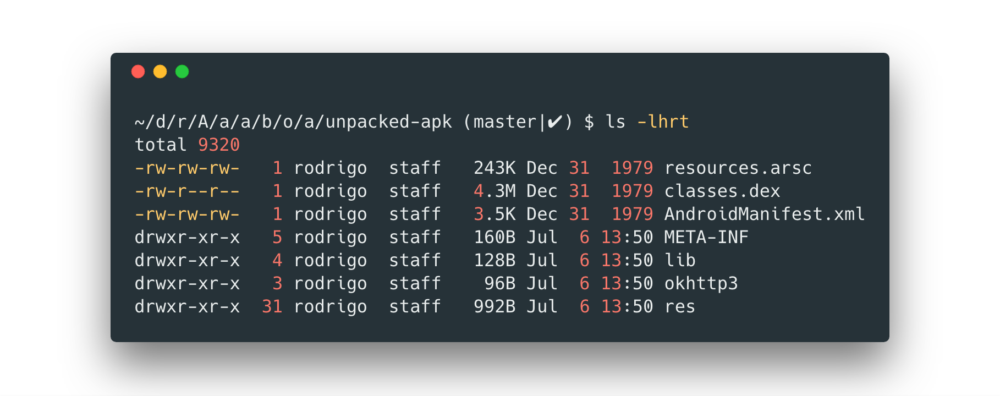

# RN AwesomeProject

## Bug

Inspecting the files inside an Android [APK](https://en.wikipedia.org/wiki/Android_application_package) created with React Native [v0.56](https://github.com/facebook/react-native/tree/v0.56.0) results in timestamps from **December 31, 1979**.

### Steps to reproduce

1. Setup project

    ```sh
    react-native init AwesomeProject
    cd AwesomeProject
    ```

1. Generate Android APK

    ```sh
    react-native run-android
    ```

1. Inspect timestamps in APK files

    ```sh
    # Navigate to APK folder
    cd android/app/build/outputs/apk
    # Unzip files
    mkdir unpacked-apk
    cd unpacked-apk
    unzip ../app-debug.apk
    ```

1. Results in wrong timestamps

